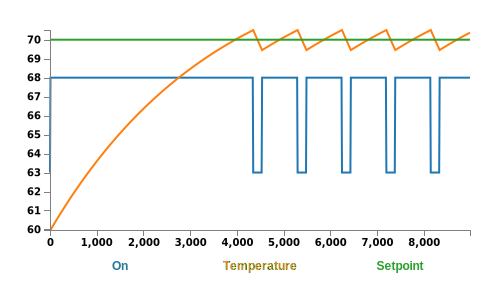
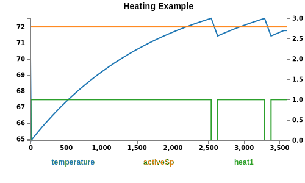

# svg-plot.js

<span class="badge-npmversion"><a href="https://npmjs.org/package/badges" title="View this project on NPM"></a></span> [](http://opensource.org/licenses/MIT)

svg-plot.js is a simple library to programatically create svg plots from csv formatted data. This is designed for regression testing where a visual component of data is desired. 

**Install:**

```console
nmp install svg-plot
```

**Usage:**

```js
var svg_plot = require('svg-plot.js');
svg_plot.plot(csvData,options)
```

## Column CSV Example:

```js
var fs = require('fs');
var svg_plot = require('../svg-plot.js')
var csvString = fs.readFileSync('testThermal.csv').toString();

svg_plot.plot(csvString,{
    fileName:'myPlot',
    timeKey:'Time'
});

// Generates myPlot.svg
```

**Usage Output:** [examples/myPlot.svg](examples/myPlot.svg)

Note, this will render on github but may not on npm's registery. See [examples/myPlot.svg](examples/myPlot.svg) for reference.

<p align='center'>
    
</p>

**CSV Format** [examples/testThermal.csv](examples/testThermal.csv)

```csv
Time,On,Temperature,Setpoint
0,63,60,70
10,68,59.97222222222222,70
20,68,60.01396604938272,70
30,68,60.05559392146776,70
40,68,60.097106160574796,70
...
```

## Pivot(row) CSV Example: 

This example demonstrates a pivot style csv file where the key is contained within the row itself. This example also demonstrates some more optional arguments.

```js
var fs = require('fs');
var svg_plot = require('../svg-plot.js')
var csvString = fs.readFileSync('testpivotThermal.csv').toString();

svg_plot.plot(csvString,{
    fileName:'mypivotPlot',
    timeKey:'Time',
    pivotCSV:true,
    pivotKey:'Point',
    pivotValue:'Value',
    y2List:['heat1'],
    includeList:['activeSp','temperature','heat1'],
    title: 'Heating Example',
    y2Range:[0,3]
});
```

**Usage Output**: [examples/myPivotPlot.svg](examples/myPivotPlot.svg)

<p align='center'>
    
</p>

**CSV Format** [examples/testPivotThermal.csv](examples/testPivotThermal.csv)

```
Event,Point,Value,Time,Info
[COV],temperature,70.000,0.000,
[COV],temperature_cov,0.100,0.000,
[COV],temperature_period,5000.000,0.000,
[COV],humidity,1.000,0.000,
[COV],humidity_cov,0.500,0.000,
[COV],csp,72.000,0.000,
[COV],hsp,72.000,0.000,
[COV],cspLimit,50.000,0.000,
[COV],hspLimit,99.000,0.000,
...
```

## Required Arguments: 

| Key | Type | Example | Description |
| ----- | ----- | ------ | ----- | 
| `fileName` | `string` | `myFile.svg` |   Name of the svg file to be generated |
| `timeKey` | `string` | `Date` | Name of the key that defines time. E.g: `Date`,`Timestamp`,`Time` 

## Optional Arguments:

| Key | Type | Example | Description |
| ----- | ----- | ------ | ----- | 
| `pivotCSV` | `bool` | `false` | Defines whether the key is in a column or a row. When the key is in the row, `pivotCSV` should be `true` | 
| `pivotKey` | `string` | `'PointName'` | Only applicable if `pivotCSV` is `true`: Define the column key which defines the row key. See pivot(row) CSV Example example. |
| `pivotValue` | `string` | `'Value'` | Only applicable if `pivotCSV` is `true`: Define the column key which defines the row value. See pivot(row) CSV Example example. |
| `y2List` | `string array` | `['heat','cool']` | Defines what, if any, keys get assigned to the y2 axis.  | 
| `ignoreList`| `string array` | `['heat','cool']` | If defined, it defines what keys are ignored / not plotted.
| `includeList` | `string array` | `['heat','cool']` | If defined, it defines what keys are plotted
|`y1Curve`| `d3.[curveType]` | `d3.curveLinear` | If defined, defines the curve style. See http://bl.ocks.org/emmasaunders/c25a147970def2b02d8c7c2719dc7502
| `y2Curve`| `d3.[curveType]` | `d3.curveLinear` | If defined, defines the curve style. See http://bl.ocks.org/emmasaunders/c25a147970def2b02d8c7c2719dc7502 | 
| `title` | `string` | `'MyTitle'` | If defined, it defines the title of the plot |  
| `y2Range` | `float array` | `[0,100]` | If defined, it defines the [min,max] of the yRange.

### About: 

This library is a wrapper around d3-node which is a wrapper around d3. 
